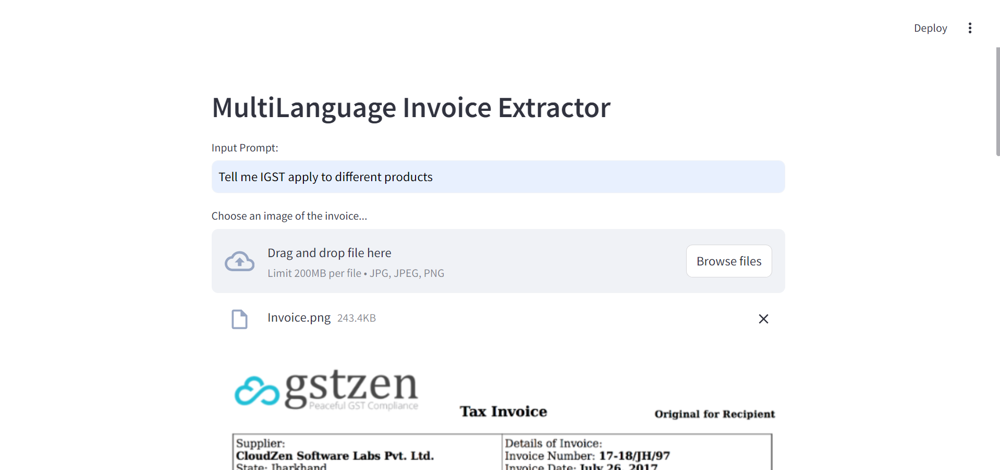
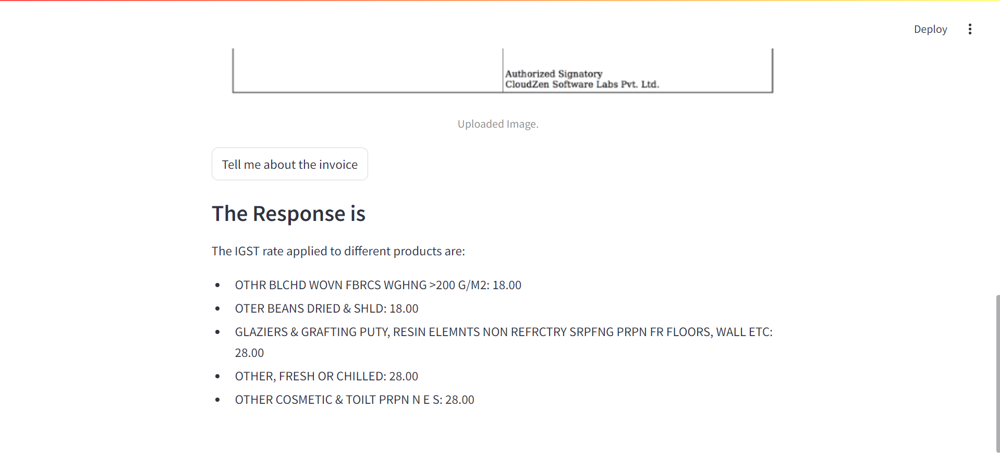
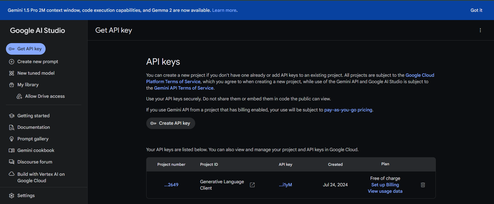

# Invoice Extractor




## Table of Contents

- [Introduction](#introduction)
- [Installation](#installation)
- [Usage](#usage)
- [Contribution](#contribution)
- [License](#license)

## Introduction

Invoice Extractor is a python project that allow you to extract information from any invoice uploaded to it


## Installation

1. Clone the repository:
   ```bash
   git clone https://github.com/Rohit131313/Invoice-Extractor.git
    ```
2. Create a Conda environment:
    ```bash
    conda create --name invoice python=3.10
    conda activate sql-env
    ```
Note:- Make sure your python version in virtual environment should be >=3.9

3. Install the required packages:
    ```bash
    pip install -r requirements.txt
    ```
## Usage
1. Create your api key
- Visit https://aistudio.google.com/app/apikey

- Click Create API Key and create your own API key
- Copy the API Key

2. Setup your environment variables:
Create a .env file in the project root directory and add your environment variables.
    ```bash
    GOOGLE_API_KEY="paste your API key"
    ```

3. Run Streamlit app
    ```bash
    streamlit run app.py
    ```


## Contribution
We welcome contributions to Invoice Extractor To contribute:

1. Fork the repository.
2. Create a new branch for your feature or bugfix.
3. Commit your changes and push your branch.
4. Submit a pull request.

We appreciate your contributions to make Invoice Extractor even better!

## License
`MIT License`